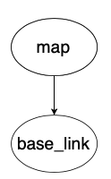
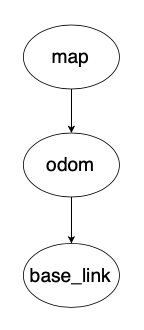

# Coordinate Frames
Coordinate frames are a set of orthogonal (perpendicular) axes attached to a body in order to describe the position of things relative to that body. By attaching coordinate frames to meaningful objects such as the robot we are able to compactly represent where in space something is in relation to objects like the robot. All coordinate frames in robotics follow the [right-hand rule](https://en.wikipedia.org/wiki/Right-hand_rule).

## Why Use Coordinate Frames?
Say we have a camera on top of a wheeled robot and the camera detects an object 100 cm in front of the robot. If the camera is located 10 cm in front of the robot's base frame, then the object is actually 110 cm from the robot's base. Attaching coordinate frames to the camera and robot base in this example allows us to transform data between the frames, an important aspect of autonomous navigation.

## World/Map Frame 
- Has its origin at a fixed position with z-axis always poiting upward
- Represents the world/environment of the robot
- Known as `map` in ROS

## Robot Frame
- Represents the robot and is used to define where sensors and other hardware are on the robot
- Has its origin in the base of the robot (origin changes as the robot moves)
- Defined in reference to the fixed world (`map`) frame
- Known as `base_link` in ROS
- For navigation, its important that `base_link` is located at the rotational center of the robot
- The `map` and `base_link` frames come from (https://www.ros.org/reps/rep-0105.html#id8 ) which defines standards that developers of different packages follow so they are able to integrate nicely. Therefore, we also follow these standards so that we can integrate multiple 3rd party packages together. [comment] <> ( add bracket here ROS REP 105 add bracket here ((https://www.ros.org/reps/rep-0105.html#id8)) )

## Relationships between Frames
A tree is used to represent the relationship between coordinate frames. In ROS this tree of relationships is called a transformation tree because the link between two nodes on the tree defines the transformation needed to go from one coordinate frame to the other and vice versa. It is important to note that a transformation consists of a translation (change in x, y, z directions to get from one frame to another) and a rotation (represented as a quaternion).

As mentioned in the msgs article, a transformation has its own msg type consisting of a Vector3 (translation) and Quaternion (rotation). However, a pose also consists of the same structure of a 3D vector and a Quaternion so it is sometimes published to represent transformations instead of a strict transformation msg type. While both msg types achieve the same thing, the different terminology and usages has been a point of confusion in the past.

The relationship for `map` and `base_link` would be called map to base_link and would be illustrated as:

In the above picture `map` is denoted as the parent frame of `base_link` because `base_link` is defined in reference to `map`.

A coordinate frame can only have 1 parent frame. The reason for why this is the case is the only time a frame could be defined in terms of two parent reference frames is if the two parent frames are identical. This means in pracitce that a coordinate frame can have a maximum of 1 unique parent frame.

While a coordinate frame can hav only 1 parent, it can have multiple children frames. For example, we could have multiple robots  `base_link1`, `base_link2`, etc. all defined in referecne to `map`. This would allow us to calculate the translations and rotations between each of the robots which could be useful if multiple robots need to collaborate in solving a problem. 

## Mobile Robot Transform Tree
The transform tree used to represent mobile robots in ROS is:

The above transform tree introduces a new coordinate frame of `odom` (short for odometry). What is the purpose of this new frame and why does it form a link between `map` and `base_link`? First we need some background.

The transformation between `map` and `base_link` is provided by a localization source where the localization source simply is computing and publishing where the robot is in reference to the origin of the map. Localization constantly re-computes the robot's pose in the `map` frame based on sensor observations, therefore eliminating drift over time, but causing discrete jumps when new sensor information arrives.

This means the pose of a robot in the `map` frame should not significantly drift over time from the true pose in the real world, however, due to the localization estimates based on new sensor data the robot's pose in the `map` frame is not continuous and can change in discrete jumps.  

While `map` is good for long term reference of a robot's pose, the discrete jumps in pose estimates make it a poor reference frame for actions that rely on accurate local knowledge of where the robot is.

`map` frame's shortcoming is why we introduce the `odom` frame into the transform tree.`odom` to `base_link` is provided by an odometry source which makes `odom` an accurate local reference frame in the short-term. `odom` is guaranteed to be continuous (no discrete jumps) allowing for accurate pose estimates of the robot in the short term.

Why is odometry only accurate in the short-term? Because as mentioned in the article on odometry, errors accumulate since each odometry estimate is based on the previous odometry estimate's position. This leads to the robot's pose in the `odom` frame drifting away from the true pose of the robot in the real world.

We want to have both `map` frame's long-term lack of drift and `odom` frame's short-term continuity. However, we cannot just make both a parent of `base_link` in the transform tree because that violates the 1 parent rule. Therefore, the transform library will subtract `odom -> base_link` from `map -> base_link` to calculate a `map -> odom` transform. This lets us create the transform tree: `map -> odom -> base_link` that satisfies the 1 parent rule.

One thing to note is that when viewing the transform tree, it will display `map -> odom` as being published by the localization source, even though the transform library is doing some internal math to make the `map` to `odom` transformation. `odom -> base_link` will be displayed as being published by our odometry source.

Note that perfectly accurate odometry would yield no difference between `map` and `odom`. However, in the real world odometry is not perfect. This means that there is a difference between where the robot is in relation to the map frame calculated by the localization source and where the robot is in relation to its last position calculated by the odometry source. 

## Static Transforms
Since `base_link` represents the robot, we can define new coordinate frames on the robot in reference to `base_link`. Say we add a camera to the front of the robot, then we would want a `camera_link` frame to represent where the camera is on the robot so any transformations can be applied to incoming images so that a correct map of the environment is built up. But in order to create this transformation from `base_link` to `camera_link` we need to create a static transform publisher that defines the constant translation and orientation needed to get from `base_link` to `camera_link`.

Note: When running the a camera node in ROS, `camera_link` will usually have multiple children frame underneath it as they are used internally by the realsense ROS driver to do the math required to give us a nice and easy to use RGB-Depth image.

## Conventions
The full coordinate frame conventions are defined in [ROS REP 103](https://www.ros.org/reps/rep-0103.html) but are summarized as follows:

The common axis convention is:
- x-axis is forward (denoted red)
- y-axis is left (denoted green)
- z-axis is up (denoted blue)

The exception is for camera frames with the `_optical` suffix:
- z-axis is forward
- x-axis is right
- y-axis is down

## Further Reading
- [(Slides) Coordinate Frames)](https://linklab-uva.github.io/autonomousracing/assets/files/L11-compressed.pdf): good to look through because it has lots of visuals to add intuition
- [(Article) Coordinate Frames & Transforms](https://automaticaddison.com/coordinate-frames-and-transforms-for-ros-based-mobile-robots/) 
- [(Slides) Odometry and Reference Frames](https://web2.qatar.cmu.edu/~gdicaro/16311-Fall17/slides/16311-LabNotes-Odometry-ROSFrames.pdf)