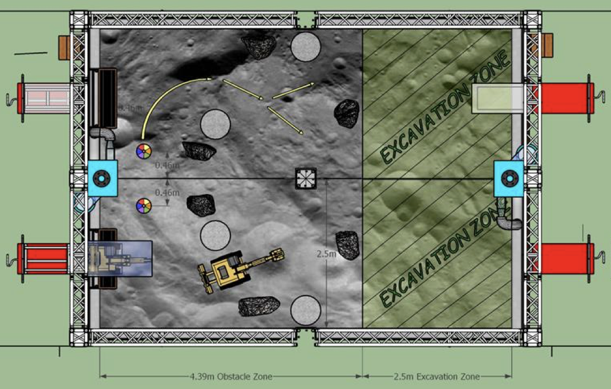
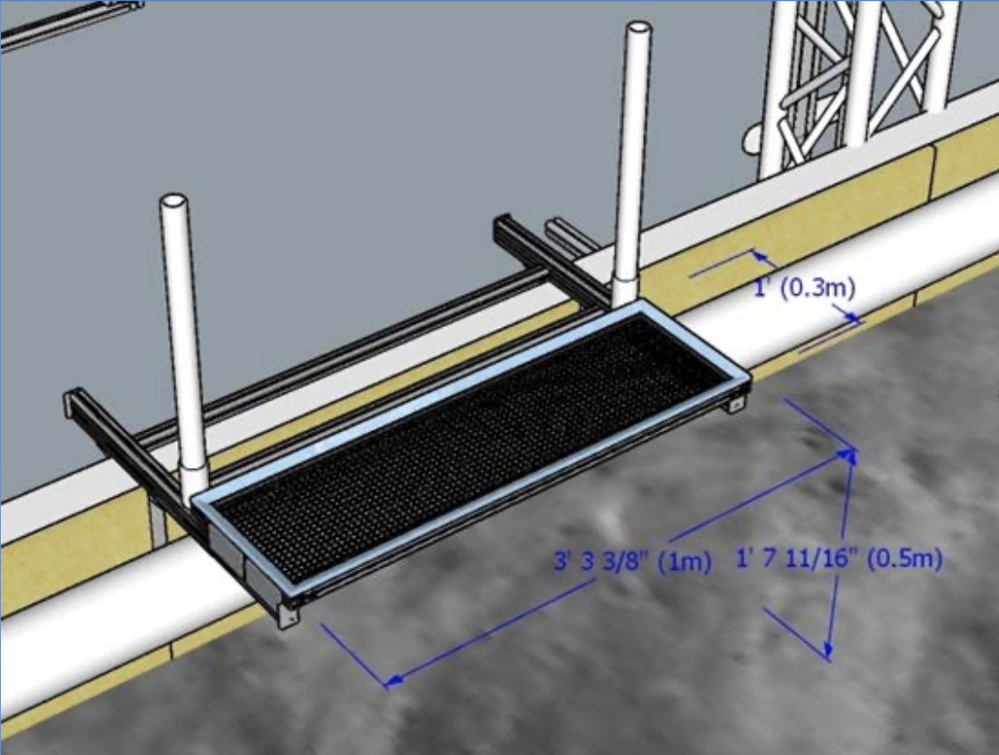

# Intro to Lunabotics
This document provides a high level overview of what our robot needs to do in order to perform well in the NASA Lunabotics competition and how we aim to achieve this performance.

## Competition
[Here](https://www.nasa.gov/sites/default/files/atoms/files/lunabotics_guidebook_2022_-_ver_1_1.pdf) are the official rules for the upcoming 2022 competition. The competition can be summarized as:
1. The robot is started in an obstacle free area near the deposition bin
2. The robot must figure out where it is in relation to the deposition bin (localize)
3. The robot must navigate through an obstacle zone to the mining area (mapping & navigation)
4. Once in the mining area, the robot must dig up rocks from under the sand and store them in the onboard deposition bucket (arm control & planning)
5. The robot must navigate back through the obstacle zone to the deposition bin (mapping, navigation, & localization)
6. The robot must dump all the rocks into the deposition bin (deposition control)
7. Repeat steps 3 through 6 as many times as possible in the alloted time in order to deposit the largest mass of rocks.

The goal on the programming team is to complete all of the above steps completely autonomously, that is without ever having any human input. If we can do all of the above completely autonomously we have a very strong shot at winning the Nasa Lunabotics competition in May! 

## Arena Layout
For quick reference, here is the field layout from the 2022 rulebook:

Here are the dimensions of the deposition bin. Note that we are allowed to hang stuff from the deposition bin as well as have a board behind the bin between the two pvc pipes.

## Our Sensors & Hardware
- **Realsense D435i (Depth Camera & Imu)**: 
  - Provides a RGB image with depth information (so therefore refered to as an RGBD image)
  - Also provides orientation and acceleration data from the buit in inertial measurement unit (IMU)
      - Sadly we can't use the orientation data because the competition constrains us to a moon environment where this data would not be available
  - Connect to the onboard computer using a USB 3.0 cable
- **Hokuyo UTM-30LX-EW Laser Range Finder (Lidar)**: provides a 2D laser scan of the environment in a 270 degree field of view
  - Connects to the onboard computer using an ethernet cable
- **Potentiometers**: measure the angle of the arm joints and connect to the CAN bus for communication with the computer  
- **Onboard Computer**: Currently a Jetson Xavier AGX but will likely be a Intel NUC in the future for a more powerful CPU
- **CAN Bus**: A network of CAN wires used for communication between the motor controllers and the onboard computer
- **Talon SRX Motor Controllers**: Control the motors according to the commands received via the CAN bus

## System Design
This is our preliminary design for achieving full autonomy for the 2022 competition:
- Figure out the position of the robot in relation to the deposition bin (localize against the deposition bin) using the lidar and in-house developed math
- Map the environment and any obstacles using the Realsense camera and a 3rd party mapping library (RTABMAP)
- Navigate to positions on the map using a 3rd party navigation library (Nav2) for planning and publishing command velocities for the robot to follow
- Move the excavation arm to dig rocks and deposit them in bucket using potentiometers to determine position of arm joints and a 3rd party library (MoveIt2) for planning and publishing the trajectory of the arm
- Dump the bucket using a motor encoder to determine when the bucket has dumped (based on the predetermined number of motor revolutions)
- Control the motors using ros_phoenix library