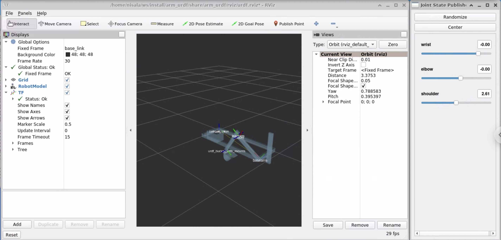

**************************
Modeling the robot: URDFs
**************************

Relevant package: `arm_urdf <https://github.com/vanderbiltrobotics/lunabot-ros2/tree/main/arm_urdf>`_

As anyone who’s ever done programming for a robotics team can attest, 
the programming team always gets the robot last. Because of this, 
ROS has several included tools that allow programmers to simulate the 
robot with CAD and test it before a robot is even physically built. 
These tools also help programmers make sure that their movement code 
won’t break the robot when it’s tested physically for the first time.

In the case of MoveIt, though, these tools are most useful for
**inverse kinematics** -- essentially, being able to tell an arm,
for example, what position to move to, and then for it to figure out
how to move to get there as quickly as possible.

URDF Basics
-----------

A URDF -- or Unified Robot Description Format -- is an XML file 
(like HTML, with tags and stuff) that describes what a robot should look like. 
It contains “links”, which are the robot parts themselves (pieces of an arm, etc.), 
and “joints” (what connect the links together). 

Here's an example of a link:

.. code-block:: xml

    <?xml version="1.0"?>
    <robot name="myfirst">
        <link name="base_link">
            <visual>
            <geometry>
                <cylinder length="0.6" radius="0.2"/>
            </geometry>
            </visual>
        </link>
    </robot>

And a joint (which goes inside <robot>):

.. code-block:: xml

    <joint name="head_swivel" type="continuous">
        <parent link="base_link" />
        <child link="head" />
        <axis xyz="0 0 1" />
        <origin xyz="0 0 0.3" />
    </joint>

The base part at (0,0,0) that the entire robot is "jointed" 
around is named the "base_link".

In addition to using basic shapes like <cylinder>, etc., 
you can also import a CAD model (with this in <geometry> of the link):

.. code-block:: xml

    <mesh filename="package://some/path/to/cad.stl"/>

Links can have collision constraints on them, which basically 
give the area of the part that no other part should ever enter. 
This can look exactly like the link geometry (so it just can’t enter the part), 
or you can add some buffer room for safety. For example:

.. code-block:: xml

    <link name="base_link">
        <visual>
            <geometry>
                <cylinder length="0.6" radius="0.2"/>
            </geometry>
            <material name="blue">
                <color rgba="0 0 .8 1"/>
            </material>
        </visual>
        <collision>
            <geometry>
                <cylinder length="0.6" radius="0.2"/>
            </geometry>
        </collision>
    </link>

.. note::

    When visualizing a URDF in RViz by itself with the 
    commands on this page, these collisions won’t show up. 
    They’ll show up in MoveIt's visualization, though.

These are the types of joints you can make:

* Fixed: rigid connection, no motion
* Revolute: support constrained rotation in 1 dimension (along a single axis) (need to specify upper and lower limits)
* Continuous: unlimited variant of revolute joints
* Prismatic: support translation in 1 dimension (along a single axis)
* Planar: translation in two dimensions
* Floating: unlimited motion (translation and rotation) in all 6 dimensions
    
.. note::

    **A Brief Aside About Xacro**

    Xacro is a macro language that potentially reduces the amount 
    of code within a urdf file. With Xacro, you can assign values to 
    constants, perform basic math (4 basic operators plus sine and cosines), and create macros. 
    We don't use Xacro, but it's useful to know what it is.

Visualizing a URDF in rviz2
----------------------------

.. note::

    In order to follow this part of the tutorial, make sure the 
    `lunabot-ros2 repository <https://github.com/vanderbiltrobotics/lunabot-ros2>`_
    is in your workspace, and that **your workspace is sourced**.

In order to visualize a URDF in rviz2, run the following command:

.. code-block:: bash

    # Launch robot.urdf in arm_urdf
    ros2 launch arm_urdf display.launch.py
    # Launch a custom URDF file (must be in directory)
    ros2 launch arm_urdf display.launch.py model:=your.urdf

Moveable joints should show up in the joint state publisher GUI.
If the GUI doesn't show up, make sure you have 
:code:`ros-foxy-joint-state-publisher-gui` installed.

onshape-to-urdf
----------------

TODO
