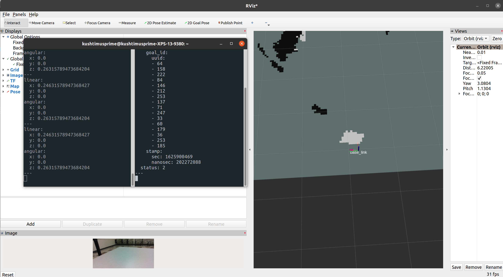

************
Launch
************

Instructions for Navigation Package Launch

The goal of this package is to be able to perform autonomous navigation to a desired goal given a costmap, localization and odometry. This process requires 4 primary nodes. The inputs for autonomous navigation including the costmap, localization and odometry come from the realsense package as described in realsense/launch. The navigation node will be in charge of outputting Twist velocities for the robot in order to successfully navigate through obstacles.

.. note::
    navigation_launch.py will launch the navigation node. However, it doesn't work without the other realsense and RTAB-Map nodes. These nodes are all grouped together in realsense_nav_launch.xml.

To verify that it works, run rviz2 and add the :code:`/map` topic and the coordinate frames map, odom and base_link to the display. You should see an accurate costmap of the environment and the base_link camera moving based on the actual Realsense movement. Next, publish a 2D goal on the display while echoing the :code:`/cmd_vel` topic and the :code:`navigate_to_pose/_action/status`. The status topic will have a status attribute of 2 while executing the navigation and will have a status attribute of 4 when the goal has been reached.

.. code-block:: bash

    ros2 launch navigation realsense_nav_launch.xml

